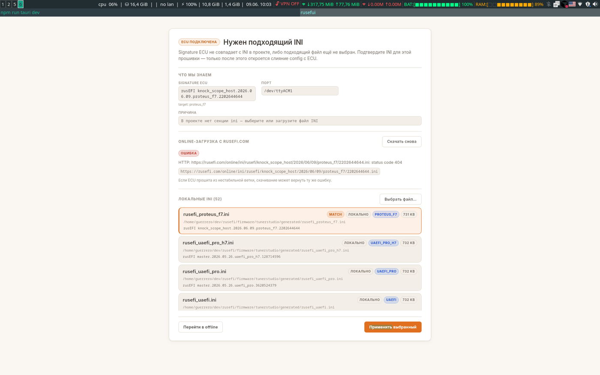
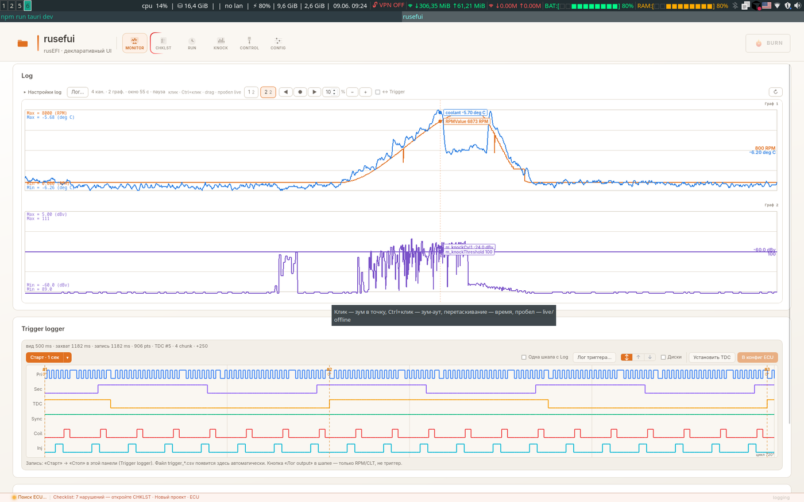
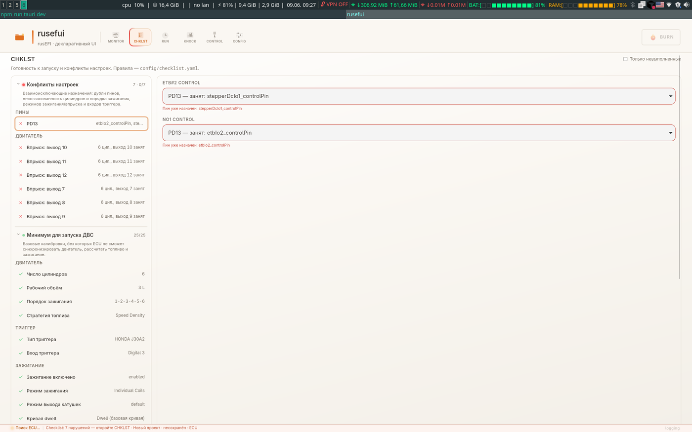
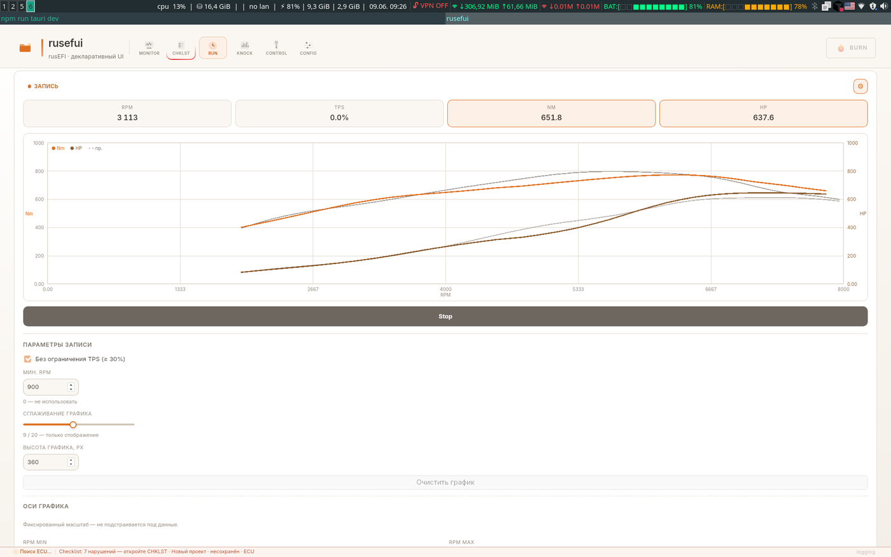
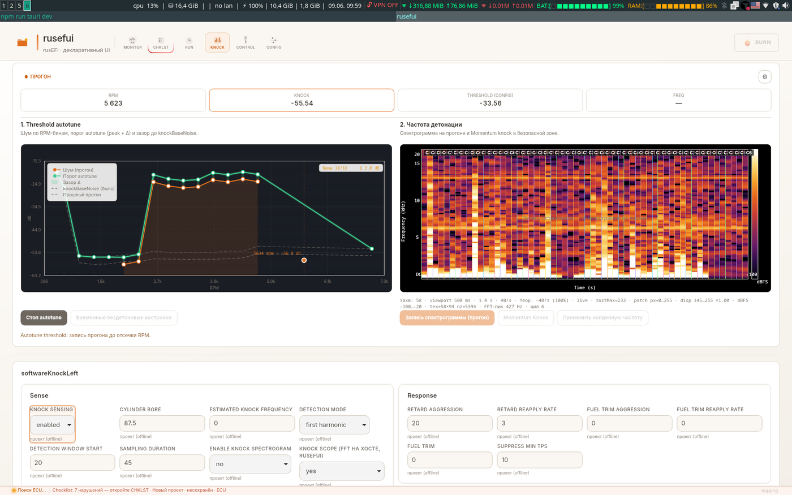
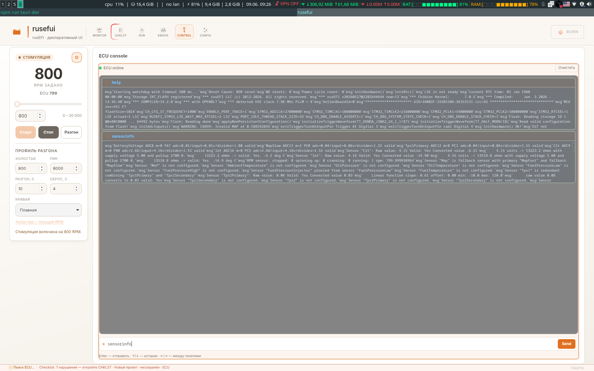
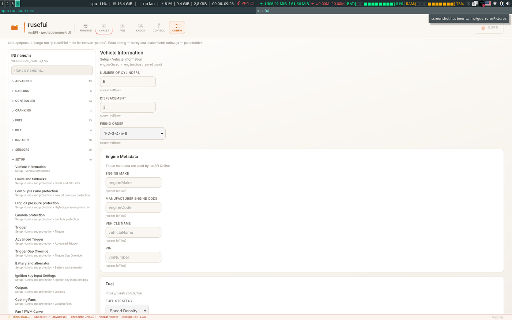
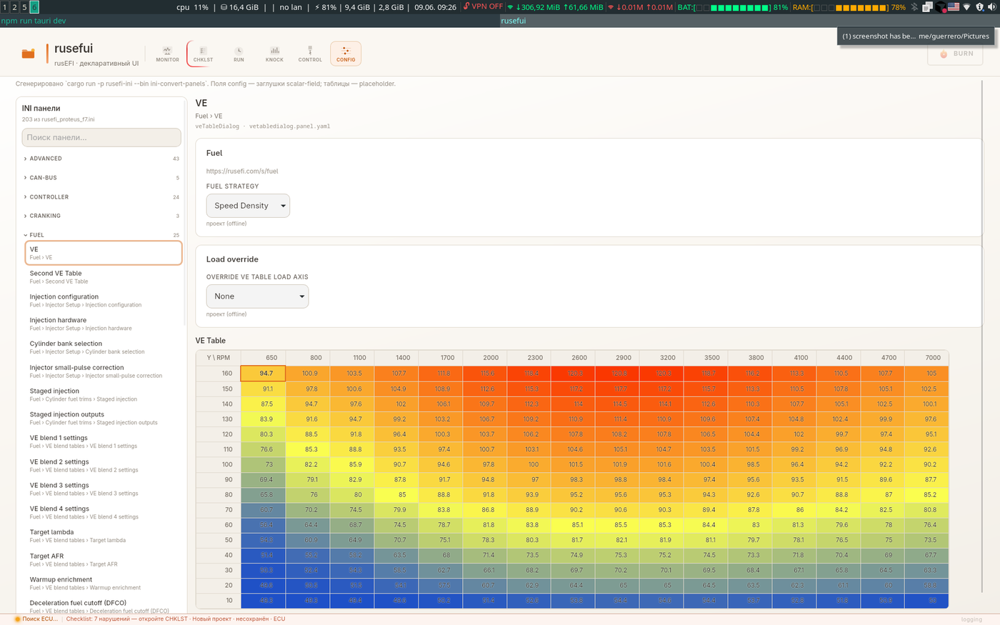
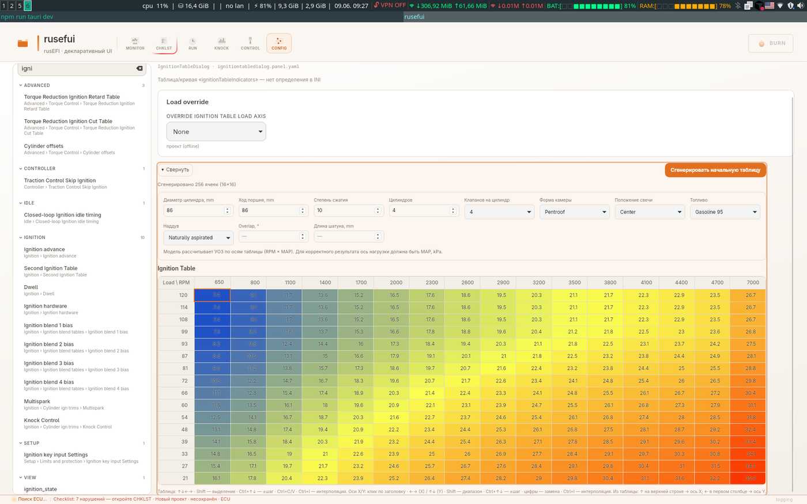

# rusefui

**Умный и чистый интерфейс для rusEFI** — кроссплатформенное приложение (Rust + Tauri + Vue), совместимое с **INI TunerStudio** и бинарным протоколом ECU (`R`/`C`/`Z`/`B`, output channels). Логика и проверки в Rust, UI без лишнего шума.

## Идея

rusefui — не клон TunerStudio «один в один», а tuner, заточенный под **быструю и осмысленную настройку**: меньше рутины, меньше ошибок, больше автоматизации.

**Основные концепции:**

- **Совместимость с INI TunerStudio** — те же `.ini` rusEFI: поля, таблицы, диалоги и signature; UI и панели строятся из INI, прошивка и экосистема TunerStudio остаются общими.
- **Клавиатура вместо мыши** — навигация, таблицы, чеклист и формы рассчитаны на работу без постоянного таскания курсора; руки остаются на клавишах.
- **Автогенерация начальных карт** — стартовые VE и УОЗ из параметров двигателя, а не пустая сетка.
- **Чеклисты** — уровни проверок консистентности и адекватности настроек (конфликты пинов, минимум для запуска, подозрительные значения); клик ведёт к полю в CONFIG.
- **Автоматизация настройки** — стимуляция триггера, консоль ECU, knock threshold autotune, запись логов и trigger logger в проект.
- **Триггер** — визуализация колёс и фаз (*в разработке*: автоматическое создание и установка параметров).
- **Автотюн** — *в разработке*.
- **Виртуальный диностенд** — кривые Nm/HP по RPM без выезда на стенд (вкладка RUN).

Подробный план: [rusefui.md](./rusefui.md).

## Скриншоты

### Подключение ECU

Выбор INI по signature: online-загрузка, локальный список с подсветкой совпадения.

<p align="center">
  
</p>

### MONITOR — логи и триггер

Output channels в реальном времени, зум и pan по времени; composite trigger logger (катушки, форсунки, sync).

<p align="center">
  
</p>

### CHKLST — чеклист перед запуском

Уровни «конфликты» и «минимум для запуска»; клик по пункту открывает поле в CONFIG.

<p align="center">
  
</p>

### RUN — виртуальный стенд

Запись кривых крутящего момента и мощности по RPM с live-цифрами и настройкой сглаживания.

<p align="center">
  
</p>

### KNOCK — детонация

Порог по RPM, спектрограмма, autotune threshold; настройки sense/response из INI.

<p align="center">
  
</p>

### CONTROL — стимуляция и консоль

Самостимуляция триггера (RPM, разгон) и текстовая консоль ECU (`help`, `sensorinfo`, …).

<p align="center">
  
</p>

### CONFIG — калибровки

Панели из INI: параметры двигателя, таблицы VE и УОЗ с автогенерацией по геометрии ДВС.

| Vehicle Information | VE table |
|:---:|:---:|
|  |  |

Параметры генерации и heatmap таблицы зажигания (общие для всех ignition-table в проекте):

<p align="center">
  
</p>

## Требования

- Rust (stable)
- Node.js 18+
- Linux: `webkit2gtk`, `libudev` (для serial)

## Разработка

```bash
npm install
npm run tauri dev
```

## Сборка

```bash
npm run build
npm run tauri build
```

## UI

**Vue** — отрисовка и действия пользователя (`dispatch`). **Rust** (`rusefui-runtime`) — логика сложных компонентов и (далее) подготовка данных по `bind.source`. Layout — YAML в `public/config/`.

См. [rusefui.md](./rusefui.md#архитектура-ui-реализовано) и [config/README.md](./config/README.md).

## Структура

- `crates/rusefi-protocol` — протокол ECU
- `crates/rusefi-ini` — парсер INI (output channels, тестовый `test_data/rusefi_proteus_f7.ini`)
- `crates/rusefui-runtime` — `EcuSession`, logic-компоненты, `OutputChannelsSource` (poll `O`)
- `test_data/` — фикстура INI для разработки (`RUSEFI_INI_PATH` для другого файла)
- `src-tauri` — `component_mount` / `component_dispatch`, событие `component-state`
- `src/composables/useRustComponent.ts` — подписка Vue на Rust state
- `public/config/` — YAML layout
- `src/components/builtins/` — SFC (presentation-only или тонкая обёртка)
