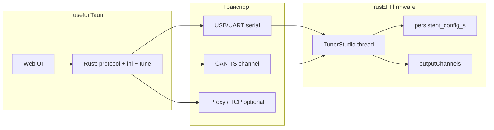

# rusEfi UI (rusefui)

Документ фиксирует цель проекта, результаты анализа протокола TunerStudio в [rusefi](../rusefi) и поэтапный план замены TunerStudio на собственный интерфейс **Rust + Tauri**.

---

## Цель

Создать кроссплатформенное desktop-приложение для настройки и мониторинга ECU rusEFI, совместимое с существующей прошивкой и экосистемой конфигурации, **без зависимости от TunerStudio (EFI Analytics)**.

Минимально жизнеспособный интерфейс должен уметь:

1. Обнаружить ECU и сопоставить её с правильным `.ini` (по **signature**).
2. Показывать live-данные (gauges / output channels) с приемлемой частотой.
3. Читать и записывать калибровку (configuration pages), выполнять **Burn**.
4. Открывать и сохранять тюны в формате, совместимом с rusEFI (`.msq` и/или бинарный образ страницы).

Долгосрочно — воспроизвести ключевые возможности rusEFI Console и TS: таблицы, диалоги, bench-команды, логи, composite/tooth logger, прошивка (отдельный трек).

---

## Контекст: что уже есть в rusefi

| Слой | Расположение | Назначение |
|------|--------------|------------|
| Прошивка, бинарный протокол | `firmware/console/binary/` (`tunerstudio.cpp`, `tunerstudio_io.*`, `tunerstudio_commands.cpp`) | Реализация TS-протокола на ECU |
| Описание данных и UI | `firmware/tunerstudio/` | Генерируемые `rusefi_*.ini`, шаблон `tunerstudio.template.ini` |
| Генерация `.ini` | `java_tools/configuration_definition`, `ConfigDefinition.jar` | Сборка INI из `rusefi_config.txt` + шаблона |
| Клиент (референс) | `java_console/io/.../binaryprotocol/` | `BinaryProtocol`, команды, CRC, работа с INI |
| Парсер INI | `java_console/inifile/` (`com.opensr5.ini`) | Метаданные полей, offset, scale, pages |
| Прокси для TS | `java_console/.../BinaryProtocolServer` | Проброс порта, чтобы TS и Console работали параллельно |
| Тесты протокола | `unit_tests/tests/test_tunerstudio.cpp` | CRC-пакеты, write chunk |
| TS plugin | `java_tools/ts_plugin/` | Расширения под TunerStudio |

Официальная спецификация INI/протокола (внешняя): [ECU Definition Specification (INI)](https://www.tunerstudio.com/index.php/support/manuals/tsdevmanuals/137-ecu-definition-specification-aka-the-ini-document), [EFI Analytics PDF](https://www.efianalytics.com/TunerStudio/docs/EFI%20Analytics%20ECU%20Definition%20files.pdf). В `firmware/tunerstudio/readme.md` — краткое описание генерации INI в rusEFI.

---

## Архитектура взаимодействия



**Signature** — строка идентификации прошивки/борды (см. `[TunerStudio] signature` в `.ini`). После подключения клиент загружает соответствующий `rusefi_<board>.ini` (локально из репозитория, кэша или загрузки — как в `RealIniFileProvider`).

---

## Протокол связи (краткая спецификация для реализации)

### Два режима кадров

1. **Plain (без CRC)** — один байт команды; используется при сканировании портов и для части «простых» команд.
2. **CRC (msEnvelope_1.0)** — основной режим; в INI: `messageEnvelopeFormat = msEnvelope_1.0`.

**Исходящий CRC-пакет (клиент → ECU):**

```
[uint16_be size][command + payload...][uint32_be crc32]
```

- `size` — длина `command + payload` (не включая заголовок и CRC).
- CRC32 считается по байтам начиная с `command` (без двух байт размера).
- Порядок CRC в потоке — big-endian (`SWAP_UINT32` на ECU).

**Входящий CRC-ответ (ECU → клиент):**

```
[uint16_be size][response_code + payload...][uint32_be crc32]
```

- `response_code == 0` (`TS_RESPONSE_OK`) — успех; payload следует за кодом.
- Ошибки: `0x80` underrun, `0x81` overrun, `0x82` CRC, `0x83` unrecognized, `0x84` out of range; burn OK — `4`.

Реализация на ECU: `TsChannelBase::crcAndWriteBuffer`, приём — `tsProcessOne()` в `tunerstudio.cpp`. Референс на Java: `IoHelper.makeCrc32Packet`, `IncomingDataBuffer.getPacket`.

**Синхронизация:** канал может быть `in_sync` / не в sync; при потере синхронизации ECU шлёт одну ошибку и снова ищет начало пакета (см. комментарии в `tunerstudio_io.h`).

### Стандартные команды (из INI + прошивки)

| Команда | Байт | Назначение |
|---------|------|------------|
| Query / Hello | `Q` / `S` | Получить signature (`TS_QUERY_COMMAND`, `TS_HELLO_COMMAND`; при скане TS шлёт `Q`) |
| Output channels | `O` | Снимок live-данных; формат `O%2o%2c` (offset, count) |
| Read page | `R` | Чтение страницы: page, offset, count (`R%2i%2o%2c`) |
| Write chunk | `C` | Запись фрагмента: page, offset, count, data |
| Burn | `B` | Commit настроек в flash (`B%2i`) |
| CRC32 check | `k` | Проверка CRC участка страницы |
| Config error | `e` | Текст ошибки конфигурации |
| FW version | `V` | Строка версии для заголовка |
| Protocol | `F` | Ответ `"001"` (`TS_PROTOCOL`) |

Пример из сгенерированного INI (`rusefi_f407-discovery.ini`):

- `nPages = 3`, `pageSize = 22848, 256, 2048`
- `pageIdentifier = "\x00\x00", "\x00\x01", "\x00\x02"` → страницы settings / scatter offsets / LTFT
- `blockingFactor = 1024` — макс. размер chunk при чтении/записи
- `ochBlockSize = 2044`, `ochGetCommand = "O%2o%2c"`

### Расширения rusEFI (не в «минимальном» TS)

Имеют смысл для полного паритета с Console; реализовывать по приоритету после MVP:

| Команда | Байт | Назначение |
|---------|------|------------|
| Execute console | `E` | Выполнить текстовую команду консоли |
| Get text log | `G` | Буфер текстового лога |
| IO test / bench | `Z` | `executeTSCommand(subsystem, index)` |
| Scatter read | `9` | High-speed scattered output (`EFI_TS_SCATTER`) |
| Composite / tooth | `l`, `8` | Logger зубьев / composite buffer |
| Perf trace | `_`, `b` | Трассировка производительности |
| Bootloader query | `L` | OpenBLT и др. |
| Test (rusEFI) | `t` / `T` | Диагностика, hash, uptime |
| Simulate CAN | `>` | Только simulator |

Константы генерируются в `rusefi_generated_*.h` / `VariableRegistryValues.java` — единый источник для прошивки и Java.

### Транспорт

- **Serial/USB** — основной; скорость из `engineConfiguration->tunerStudioSerialSpeed`.
- **CAN** — `firmware/console/binary/ts_can_channel.cpp` (`CanTsChannel`), фрагментация больших пакетов.
- **TCP proxy** — rusEFI Console поднимает прокси (порт по умолчанию в INI `29001`, `BinaryProtocolServer` — `2390`); полезно для отладки и совместного доступа TS + другой клиент.

### Данные конфигурации

- Страница **0** (`TS_PAGE_SETTINGS`) — образ `persistent_config_s` / `engineConfiguration`, размер `TOTAL_CONFIG_SIZE` (до 64 KiB, ограничение offset в протоколе).
- Поля в INI секции `[Constants]` задают **offset, type, scale, translate, min/max** — клиент обязан кодировать/декодировать так же, как TS.
- **Output channels** — секция `[OutputChannels]` в INI; на ECU заполняется из `engine->outputChannels` и live data fragments (`copyRange` + `getLiveDataFragments()`).

### Файлы тюна

- **`.msq`** — XML (TunerStudio), используется в `java_tools/tune-tools`, Console.
- Бинарный **ConfigurationImage** — сырой образ страницы 0; загрузка diff-ами через `WriteChunkCommand` (`BinaryProtocol.uploadChanges`).

---

## INI как «контракт» UI и данных

Генерация (см. `firmware/tunerstudio/readme.md`):

1. `integration/rusefi_config.txt` — поля конфигурации (offsets, типы).
2. `firmware/tunerstudio/tunerstudio.template.ini` — меню, диалоги, таблицы (`menuDialog = main` и ниже).
3. `mapping.yaml`, `prepend.txt` — условная видимость (`@@if_XXX`).
4. Результат: `firmware/tunerstudio/generated/rusefi_<board>.ini` (десятки тысяч строк).

Для rusefui возможны стратегии UI:

| Стратегия | Плюсы | Минусы |
|-----------|-------|--------|
| **A. Парсить INI** (как `opensr5`) | Полная совместимость с TS-описанием, один источник правды | Огромные INI, сложный парсер, воспроизведение всех виджетов TS |
| **B. Генерировать UI из `rusefi_config` / JSON** | Современный UX, меньше legacy | Дублирование с `tunerstudio.template.ini`, риск рассинхрона |
| **C. Гибрид** | MVP: gauges + ключевые экраны из INI; постепенно свой UI | Два пути поддержки |

**Рекомендация для плана:** начать с **протокола + INI metadata (Constants/OutputChannels)** без полного рендера `menuDialog`; UI проектировать в Tauri, поля подтягивать по имени/offset из INI.

---

## Референсы для портирования на Rust

При реализации сверять поведение с:

1. `firmware/console/binary/tunerstudio.cpp` — эталон протокола.
2. `java_console/io/.../BinaryProtocol.java` — сессия, pull output channels, upload diff.
3. `java_console/io/.../IoHelper.java` — упаковка CRC.
4. `java_console/inifile/` — парсинг offset/type/scale.
5. `unit_tests/tests/test_tunerstudio.cpp` — CRC и write chunk.

Полезно поднять **firmware simulator** или реальную плату для интеграционных тестов протокола без TS.

---

## Нефункциональные требования

- **Совместимость:** тот же бинарный протокол и signature, что у актуальной прошивки; не менять ECU под клиент.
- **Производительность:** `defaultRuntimeRecordPerSec` в INI до 100 Hz; клиент не должен блокировать UI (async I/O, отдельный поток чтения порта).
- **Надёжность:** обработка потери sync, таймауты (на ECU ~1 s / 10 ms между байтами пакета).
- **Безопасность:** запись во flash только после явного Burn; предупреждение при несовпадении signature/INI.
- **Лицензии:** прошивка GPL; TS — проприетарный UI, мы его не используем; INI-файлы rusEFI — часть репозитория rusefi.

---

## План работ (этапы)

### Фаза 0 — Подготовка (текущая)

- [x] Изучить протокол и артефакты в rusefi
- [x] Зафиксировать цель и план в `rusefui.md`
- [ ] Выбрать целевую плату/signature для первого e2e (например `f407-discovery`)
- [ ] Согласовать стратегию UI (A/B/C выше)

### Фаза 1 — Rust core (без UI или CLI)

1. Crate `rusefi-protocol`: CRC envelope, коды ответов, encode/decode команд `S`, `O`, `R`, `C`, `B`, `k`, `e`, `V`.
2. Транспорт: serialport (кроссплатформенно); опционально TCP-клиент к rusEFI proxy.
3. Модуль `signature`: handshake, сопоставление с файлом `.ini`.
4. Интеграционные тесты против simulator / loopback по образцу unit-тестов rusefi.

### Фаза 2 — INI и калибровка

1. Парсер минимального подмножества INI: `[MegaTune]`/`[TunerStudio]` signature, `[Constants]` (scalar/array), `[OutputChannels]`, `blockingFactor`, `pageSize`, `nPages`.
2. Декодирование output channels в именованные значения (scale/translate).
3. Чтение полной страницы 0, запись chunk + burn.
4. Импорт/экспорт `.msq` (или только бинарный `.bin` tune на первом этапе).

### Фаза 3 — Tauri MVP

1. Каркас Tauri 2 + выбор frontend (React/Svelte/Vue).
2. Экран подключения: список портов, подключение, отображение signature и версии.
3. Dashboard: набор gauges из `[OutputChannels]` (конфигурируемый список / пресет).
4. Базовый редактор: поиск поля по имени, правка scalar, запись, burn.
5. Лог ошибок ECU (`e`, текстовый pull `G` — опционально).

### Фаза 4 — Расширенный функционал

1. Таблицы 2D/3D (VE, timing…) из INI `table` / `curve`.
2. Команды `Z` (bench), composite logger (`l`/`8`).
3. Совместимость с rusEFI proxy (работа рядом с другими инструментами).
4. Локализация (аналог `firmware/tunerstudio/translations`).

### Фаза 5 — Полировка и релиз

1. Автообновление INI по signature (как `SignatureHelper.downloadIfNotAvailable`).
2. Документация пользователя, упаковка (Linux/Windows/macOS).
3. CI: тесты протокола + линтеры.

---

## Структура репозитория rusefui (предварительно)

```
rusefui/
  rusefui.md              # этот документ
  crates/
    rusefi-protocol/      # бинарный протокол
    rusefi-ini/            # парсер INI
  src-tauri/              # оболочка Tauri
  ui/                     # frontend
  ini/                    # симлинк или копия generated INI для dev
  tests/
    fixtures/             # захваченные пакеты, эталонные .msq
```

Связь с rusefi: submodule или путь `../rusefi`; INI брать из `firmware/tunerstudio/generated/` при разработке.

---

## Риски и открытые вопросы

1. **Объём INI** — полный парсер и рендер как TS — многомесячный проект; нужен явный scope MVP.
2. **Расширения протокола** — поведение может отличаться от «чистого» MegaSquirt/TS; ориентир — прошивка, не только PDF.
3. **Версионность signature** — при несовпадении INI и прошивки offsets ломают калибровку; обязательна жёсткая проверка.
4. **CAN vs USB** — разные каналы, разная фрагментация; CAN можно отложить после serial MVP.
5. **Прошивка ECU** — OpenBLT/XCP (`libopenblt` в Console) — отдельный модуль, не TS binary protocol.

---

## Ссылки внутри rusefi

| Тема | Путь |
|------|------|
| Реализация протокола | `firmware/console/binary/tunerstudio.cpp` |
| Формат пакетов | `firmware/console/binary/tunerstudio_io.cpp` |
| Генерация INI | `firmware/tunerstudio/readme.md` |
| Пример INI | `firmware/tunerstudio/generated/rusefi_f407-discovery.ini` |
| Java-клиент | `java_console/io/src/main/java/com/rusefi/binaryprotocol/` |
| Парсер INI | `java_console/inifile/src/main/java/com/opensr5/ini/` |
| Тесты | `unit_tests/tests/test_tunerstudio.cpp` |

---

*Документ создан по результатам анализа репозитория rusefi (май 2026). Следующий шаг — Фаза 1: каркас Rust crate и proof-of-concept подключения по serial.*
